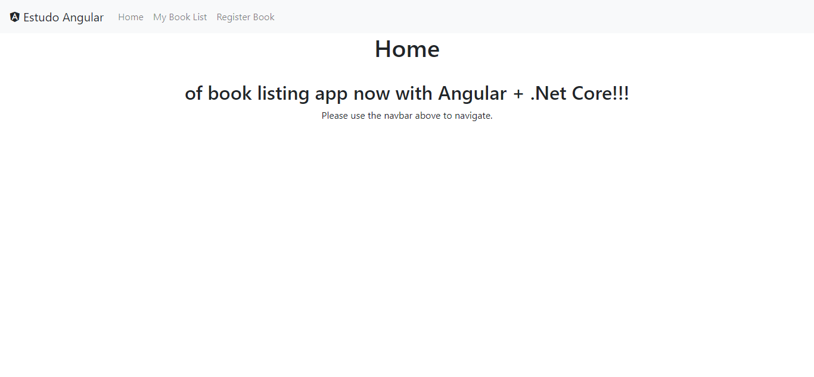
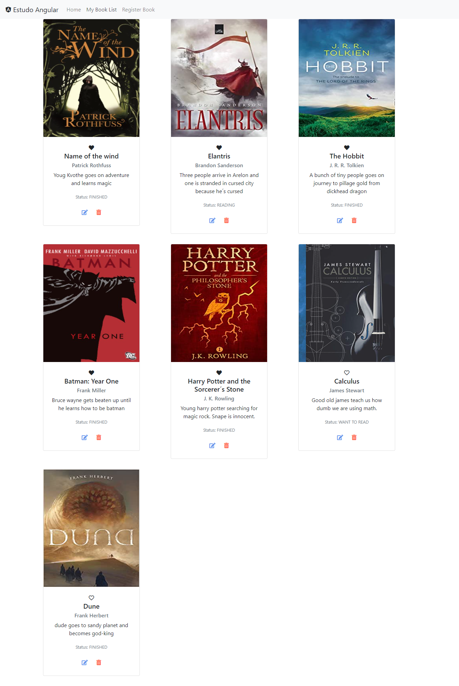
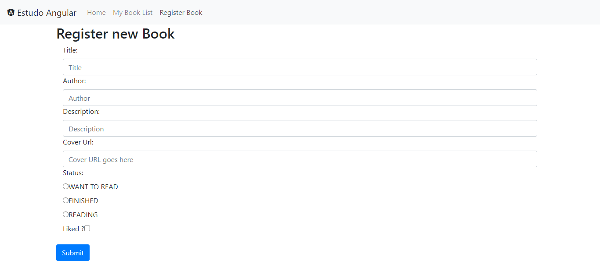
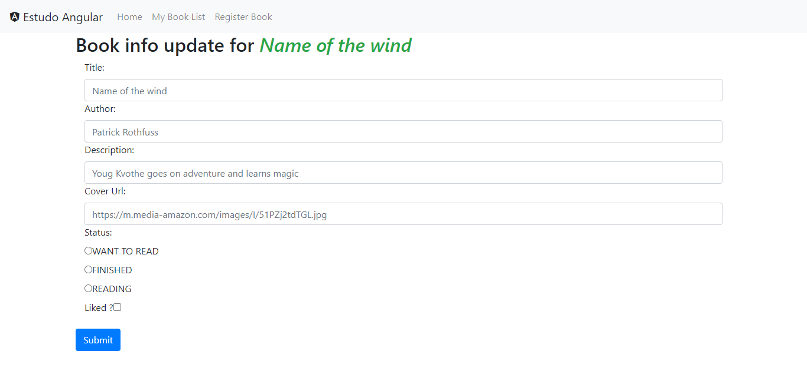

# Estudo Angular - Book listing app

A app for tracking readings.

## Getting Started

These instructions will get you a copy of the project up and running on your local machine for development and testing purposes.

### Prerequisites

What things you need to install the software and how to install them

- .Net Core → Version: 3.1.412;
- Angular → Version 12.2.9;

### Installing

In order to run this app you will need to run the Front-End as well as the Back-End, to do this you will need to create a MySql Schema, run the Back-End commands to get the API up and running and after that you will need to run the Front-End. Please, follow the following steps to successfully run this app´s instance:

1. Clone the repository to you machine;

2. Create the MySql Schema using the information below:

   > server=localhost;
   >
   > port=3306;
   >
   > database=bookapi;
   >
   > uid=root;
   >
   > password=root;

3. Run the following commands in the shell:
   > Inside ./EstudoAngular/real-backend:
   >
   > ```
   > dotnet restore
   > dotnet ef database update
   > dotnet watch run
   > ```
   >
   > Inside ./EstudoAngular:
   >
   > ```
   > npm install
   > ng serve
   > ```

Then just access : http://localhost:4200/home .

## Built With

- [.Net Core](https://dotnet.microsoft.com/download) → Version: 3.1.412;
- [Microsoft.EntityFrameworkCore.Design](https://www.nuget.org/packages/Microsoft.EntityFrameworkCore.Design/3.1.17) → Version: 3.1.17;
- [Angular](https://angular.io/) → Version: 12.2.9;

## Examples:






## Authors

- **Leonardo Machado** - _LOMH_ - [LeoMac00](https://github.com/leomac00)

## TODO

- Beautify interface;
- Implement Login features to API and Front-end;
- Implement security measures (tokens and such);
